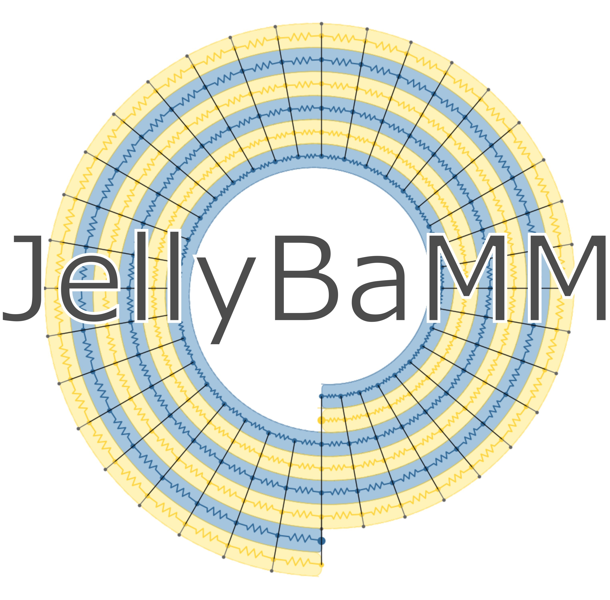

# Welcome to JellyBamm

The lithium-ion battery cell simulator powered by [PyBaMM](https://www.pybamm.org/). JellyBamm allows you to specify cyclindrical jellyroll cell designs parametrically or extract them from images.

Leverage the experiments and parameter sets from PyBaMM and scale up your simulations from 1D representations to detailed 2D and 3D cell simulations. Include thermal effects and account for inhomogenteities introduced by tabs or variable inputs for heat transfer.

Include statistical distributions in the battery parameters for sections of the cell.
